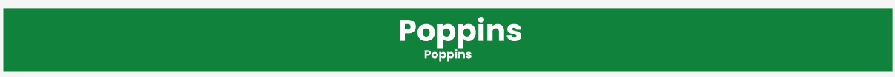
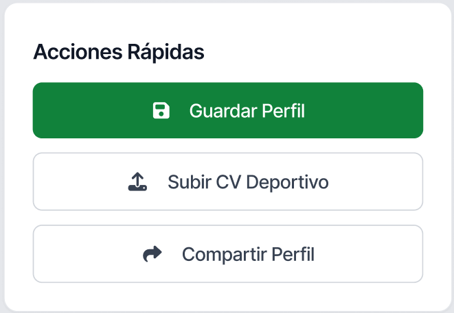

# TechCup Sistemas - Frontend

Plataforma web para gestionar el torneo interno de fútbol de la Facultad de Ingeniería de Sistemas

---

## Índice

- [Manual de Identidad Visual](#manual-de-identidad-visual)
  - [Logotipo](#logotipo)
  - [Paleta de Colores](#paleta-de-colores)
  - [Tipografía](#tipografía)
  - [Componentes UI](#componentes-ui)
  - [Mockups](#mockups)
- [Público Objetivo y accesibilidad](#público-objetivo-y-accesibilidad)
- [Documentación Completa](#documentación-completa)

---

## Manual de Identidad Visual

### Logotipo

  

**Diseño:** Moderno, deportivo y minimalista  
**Concepto:** Fusión entre tecnología y competencia deportiva

---

### Paleta de Colores

Nuestra identidad visual utiliza **tonos verdes** que representan tecnología, innovación y entornos digitales.

#### Color Principal

#### Colores de Texto Colaborativo

  
  
  
  

#### Colores de Botones

  
  
  

#### Colores de Símbolos

  
  
  
  

#### Fondos

  
  

**[¿Por qué estos colores?](./docs/planing/colores-accesibilidad.md)** → Diseñados pensando en accesibilidad y daltonismo

---

### Tipografía

#### Poppins - Títulos y Botones

**¿Por qué Poppins?**  
- Estructura geométrica clara  
- Facilita identificación de elementos importantes  
- Moderna y legible en pantallas  
- Perfecta para llamadas a la acción

#### Montserrat - Subtítulos y Contenido

**¿Por qué Montserrat?**  
- Excelente legibilidad en tamaños pequeños  
- Fácil de escanear visualmente  
- Versátil para diferentes contextos  
- Complementa perfectamente con Poppins

---

### Componentes UI

#### Elementos de Interfaz

| Componente | Descripción | Uso |
|------------|-------------|-----|
| **Barra de Navegación** | Superior con logo y enlaces | Navegación principal |
| **Botones Primarios** | Acciones principales | Registro, Login, Guardar |
| **Botones Secundarios** | Acciones complementarias | Cancelar, Volver |
| **Tarjetas** | Contenedores visuales | Equipos, Partidos, Estadísticas |
| **Iconos** | Elementos gráficos | Comprensión rápida |
| **Sección de Pasos** | Guía secuencial | Onboarding de usuarios |

---

### Mockups

**[Ver Mockup Completo](./docs/mockup-sprint-3.md)** - Diseño completo en Figma del Sprint 3

#### Página Principal

**Características:**
- llamada a la acción clara
- Navegación intuitiva
- Diseño responsive
- Jerarquía visual definida y mas amena

#### Registro de Usuario Institucional

**Características:**
- Validación en tiempo real
- Feedback visual claro
- Proceso simplificado por rol

#### Inicio de sesión

**Características:**
- Ubicación de los roles
- Diseño amable con el usuario
- Facil accesibilidad

---
## Público objetivo y accesibilidad

**[Publico objetivo y accesibilidad](./docs/publico-objetivo-y-accesibilidad.md)**

Explicación detallada de por que escogimos esos colores, simbolos,y todas las cosas que elegimos de acuerdo a nuestro público objetivo 

---

## Documentación Completa

**[Recursos Visuales](./docs/Images/ManualDeIdentidad/)**  
Imágenes, mockups y assets del proyecto

**[Mockup Sprint 3](./docs/mockup-sprint-3.md)**  
Diseño completo en Figma
